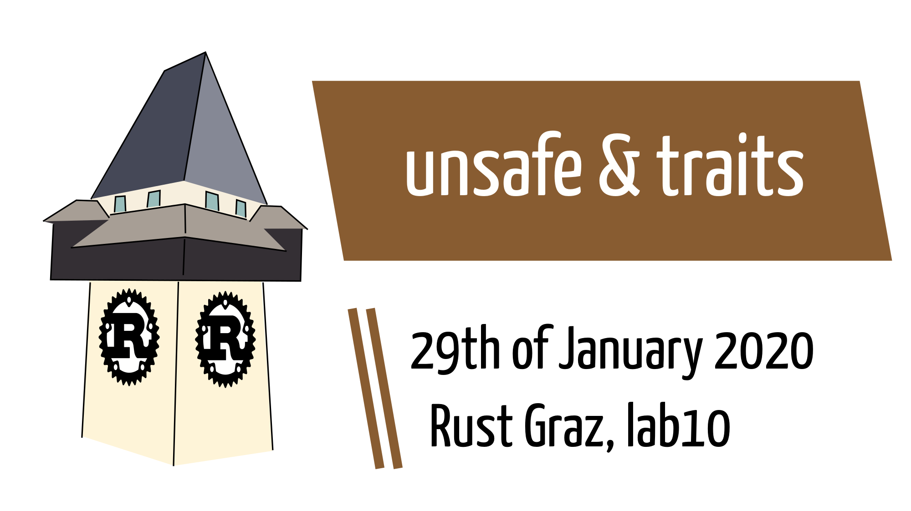

# Object-oriented programming

---

## One definition of OOP

1. Inheritance
2. Polymorphism
3. Data encapsulation

---

## Popularized by Simula (1960s)

via [Wikipedia](https://en.wikipedia.org/wiki/Simula#Classes,_subclasses_and_virtual_procedures)

```simula
Glyph Class Char (c);
  Character c;
Begin
  Procedure print;
    OutChar(c);
End;
```

---

## Definition by Gang of Four

> Object-oriented programs are made up of objects. An object packages both data and the procedures that operate on that data. The procedures are typically called methods or operations.

---

## Is rust an OOP language?

Yes and no. Depends on definition.

(BTW, I would like to stress that OOP is not always class-based OOP. JavaScript and Lua, for example, use prototype-based OOP)


# Traits

---

## Definition

> In computer programming, a trait is a concept used in object-oriented programming, which represents a set of methods that can be used to extend the functionality of a class

Self ⇒ {PHP, rust, Scala, …}

---

## rust traits

* Inheritance ⇒ no, but default implementations for code reuse
* Polymorphism ⇒ generics and trait bounds
* Data encapsulation ⇒ `pub` keyword

---

## Trait example

via [rust book](https://doc.rust-lang.org/stable/book/ch17-01-what-is-oo.html#objects-contain-data-and-behavior)

```rust
pub struct AveragedCollection {
    list: Vec<i32>,
    average: f64,
}
```

---

## Trait example

```rust
impl AveragedCollection {
    pub fn add(&mut self, value: i32) {
        self.list.push(value);
        self.update_average();
    }

    pub fn remove(&mut self) -> Option<i32> {
        let result = self.list.pop();
        match result {
            Some(value) => {
                self.update_average();
                Some(value)
            },
            None => None,
        }
    }

    pub fn average(&self) -> f64 {
        self.average
    }

    fn update_average(&mut self) {
        let total: i32 = self.list.iter().sum();
        self.average = total as f64 / self.list.len() as f64;
    }
}
```

---

## Trait example

* `AveragedCollection` implements 4 methods
* 3 methods constitute the public API
* We can define an interface, which must be implemented to satisfy a `trait`

---

## Trait syntax

```rust
pub trait Average {
    fn average(&self) -> f64;
}
```

⇒ `AveragedCollection` must implement trait explicitly

---

## Trait example

```rust
impl Average for AveragedCollection {
    fn average(&self) -> f64 {
        self.average
    }
}
```

⇒ `AveragedCollection` implements `Average` explicitly


# Epilogue

---

[mitsuhiko](https://twitter.com/mitsuhiko/status/1204523300468248577) on Twitter:

> I'm sorry but that floats/doubles are not Eq in rust is somewhere between hugely frustrating and bullshit. Not sure where. It makes the simplest things really complex for no real added benefit.

---

[simnalamburt](https://twitter.com/simnalamburt/status/1204553345794396160) on Twitter:

> They can’t be “Eq” since ‘NaN == NaN’ should be evaluated as false due to IEEE 754
>
> Trust me you’ll be much more angry and seriously more frustrated if they are “Eq” and disobey IEEE 754.

---

## Next session

Wed, 2019/02/26 19:00

Topic: Generics

---

# Thanks!
